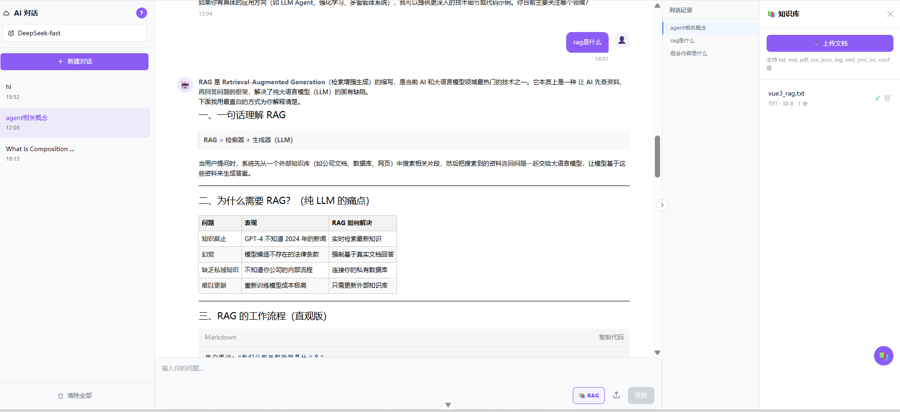

# ChatAI - AI 健康知识库对话平台

基于 **Vue 3 + Vite + TypeScript + FastAPI + LangChain/LangGraph + ChromaDB** 构建的 AI 健康知识库对话平台。项目支持 OpenRouter 统一模型网关流式对话、会话持久化、聊天附件文本拼接、Markdown 渲染、知识库文档上传，以及基于 ChromaDB + ZhipuAI/OpenAI/ONNX embeddings 的 RAG 检索。



## 功能特性

- **流式对话**: 后端通过 SSE 输出 `delta`、`tool_call`、`tool_result`、`done`、`error` 等类型化事件。
- **Agent 工具调用**: 当前 Agent 基于 `langchain.agents.create_agent`，注册 `search_knowledge` 作为知识库检索工具，由模型自主决定是否调用。
- **知识库 RAG**: 支持上传 txt、md、pdf、csv、json 等文档，自动加载、中文优先分块、向量化并写入 ChromaDB。
- **混合检索能力**: 支持 HyDE、向量检索、BM25/词法检索、RRF 融合和可选 rerank 配置。
- **上下文连续性**: 后端从 SQLite 构建会话上下文，并维护持久化滚动摘要；不依赖前端传完整历史作为可信上下文。
- **长期记忆**: 支持跨会话情景记忆检索、用户健康画像和可追溯长期事实管理。
- **会话管理**: SQLite 持久化会话与消息，支持多会话切换、消息读取和删除。
- **聊天附件**: 前端读取文本附件并拼接进用户消息内容后发送给后端。
- **Markdown 渲染**: 支持代码高亮、KaTeX、Mermaid 等富文本展示。
- **RAGAS 评估**: 后端提供 `/api/eval/*` 评估端点，可运行 RAGAS 指标、回归基线和检索专项评估。

## 项目结构

```text
chatAI/
├── frontend/                         # Vue 3 前端
│   ├── src/
│   │   ├── api/                      # chat、conversation、knowledge API 客户端
│   │   ├── components/               # 聊天、知识库、布局组件
│   │   ├── pages/                    # 聊天主页面
│   │   ├── stores/                   # Pinia 状态管理
│   │   ├── styles/                   # SCSS 与 Markdown 样式
│   │   └── utils/                    # SSE 解析、Markdown 渲染等工具
│   ├── package.json
│   └── vite.config.ts
├── server/                           # FastAPI 后端
│   ├── app/
│   │   ├── api/                      # chat、conversations、knowledge、memory 端点
│   │   ├── core/                     # database、SSE
│   │   ├── models/                   # SQLAlchemy ORM
│   │   ├── rag/                      # loader、splitter、embedder、retriever、prompt
│   │   ├── schemas/                  # Pydantic schema
│   │   ├── services/                 # Agent、RAG、上下文、记忆服务
│   │   └── tools/                    # search_knowledge LangChain tool
│   ├── data/                         # SQLite、ChromaDB、uploads，默认 gitignored
│   ├── evaluation/                   # RAGAS 与检索评估
│   ├── .env.example
│   └── pyproject.toml
├── AGENTS.md                         # Coding agent 工作说明
├── CLAUDE.md                         # 与 AGENTS.md 同步的开发说明
└── README.md
```

## 环境要求

- **Node.js**: `^20.19.0 || >=22.12.0`
- **pnpm**: 前端包管理器
- **Python**: `>=3.11`
- **后端 API Key**: 至少需要 `OPENROUTER_API_KEY`

## 快速开始

### 1. 配置后端环境

```bash
cd server
cp .env.example .env
```

编辑 `server/.env`，至少填写：

```env
OPENROUTER_API_KEY=your-openrouter-api-key
OPENROUTER_BASE_URL=https://openrouter.ai/api/v1
OPENROUTER_MODEL=deepseek/deepseek-chat
OPENROUTER_LIGHT_MODEL=deepseek/deepseek-chat
OPENROUTER_JUDGE_MODEL=z-ai/glm-5.2

# 知识库 embedding 优先使用 ZhipuAI；未配置时按 OpenAI / ONNX fallback
ZHIPUAI_API_KEY=your-zhipu-api-key
ZHIPUAI_EMBEDDING_MODEL=embedding-2
```

embedding 优先级：

```text
ZhipuAI embedding-2 -> OpenAI text-embedding-3-small -> ONNX all-MiniLM-L6-v2
```

### 2. 安装依赖

```bash
# 前端
cd frontend
pnpm install

# 后端
cd ../server
pip install -e .
```

如果需要运行 RAGAS 评估，还需要安装可选依赖：

```bash
cd server
pip install ragas datasets pandas
```

### 3. 启动开发服务

```bash
# 终端 1: 后端，端口 3001
cd server
uvicorn app.main:app --port 3001 --reload

# 终端 2: 前端，端口 3000
cd frontend
pnpm dev
```

浏览器打开：

```text
http://localhost:3000
```

前端开发服务器会把 `/api` 请求代理到 `http://localhost:3001`。

## 常用命令

### 前端

```bash
cd frontend
pnpm dev
pnpm build
pnpm type-check
pnpm lint
```

### 后端

```bash
cd server
pip install -e .
uvicorn app.main:app --port 3001 --reload
```

### RAGAS 评估

```bash
cd server
pip install ragas datasets pandas

# 1. 运行 RAG + Agent，填充测试集的 answer 和 contexts
curl -X POST http://localhost:3001/api/eval/prepare

# 2. 计算 RAGAS 指标
curl -X POST http://localhost:3001/api/eval/run

# 3. 查看最新报告
curl http://localhost:3001/api/eval/report/latest
```

检索专项评估：

```bash
curl http://localhost:3001/api/eval/retrieval/test-cases
curl -X POST http://localhost:3001/api/eval/retrieval/run
```

## 核心数据流

### 聊天请求

```text
POST /api/chat
  -> 查找或创建 Conversation
  -> 持久化本轮 user Message
  -> 从 SQLite 构建会话上下文和滚动摘要
  -> 检索跨会话情景记忆
  -> 读取用户健康画像
  -> AgentService.run()
       -> 注入摘要、记忆、画像 system memory block
       -> create_agent(...).astream(...)
       -> 模型按需调用 search_knowledge(query)
       -> 输出 typed SSE events
  -> 持久化 assistant Message
  -> 异步更新滚动摘要、情景记忆和用户画像
```

### RAG 工具调用

`search_knowledge` 是当前注册给 Agent 的知识库工具：

```text
Agent -> search_knowledge(query)
       -> augment_chat(system_prompt="", history=[], user_content=query)
       -> HyDE 生成假想健康文档片段
       -> embedding + ChromaDB 检索
       -> 返回带来源片段的工具结果
```

注意：前端没有旧版 `use_rag` 开关。所有对话统一走 `/api/chat`，是否检索知识库由 Agent 自主决定。

## API 概览

### `POST /api/chat`

请求体：

```json
{
  "conversation_id": "uuid-or-null",
  "model": "openrouter",
  "messages": [
    {
      "role": "user",
      "content": "高血压患者饮食应该注意什么？"
    }
  ],
  "files": [
    {
      "id": "optional-file-id",
      "filename": "optional-file-name.txt"
    }
  ]
}
```

SSE 事件：

```text
event: delta
data: {"choices":[{"delta":{"content":"..."}}]}

event: tool_call
data: {"tool_call_id":"...","tool_name":"search_knowledge","arguments":"..."}

event: tool_result
data: {"tool_call_id":"...","tool_name":"search_knowledge","result":"...","success":true}

event: done
data: [DONE]
```

### 常用端点

| 方法 | 路径 | 说明 |
| --- | --- | --- |
| `GET` | `/api/health` | 健康检查 |
| `POST` | `/api/chat` | SSE 流式聊天 |
| `GET` | `/api/conversations` | 会话列表 |
| `POST` | `/api/conversations` | 创建会话 |
| `GET` | `/api/conversations/{id}/messages` | 获取会话消息 |
| `DELETE` | `/api/conversations/{id}` | 删除会话 |
| `GET` | `/api/knowledge/documents` | 知识库文档列表 |
| `POST` | `/api/knowledge/documents` | 上传知识库文档 |
| `DELETE` | `/api/knowledge/documents/{id}` | 删除知识库文档 |
| `GET` | `/api/memory/profile` | 获取用户画像 |
| `GET` | `/api/memory/facts` | 获取长期事实 |
| `POST` | `/api/eval/prepare` | 准备 RAGAS 评估数据 |
| `POST` | `/api/eval/run` | 运行 RAGAS 评估 |
| `GET` | `/api/eval/report/latest` | 查看最新评估报告 |
| `POST` | `/api/eval/retrieval/run` | 运行检索专项评估 |

## RAGAS 评估说明

项目已经接入 RAGAS，但它是可选评估模块，不参与普通 `/api/chat` 运行链路。

当前评估实现位于 `server/evaluation/`：

- `api.py`: `/api/eval/*` 端点。
- `runner.py`: 执行 RAG + Agent 准备测试数据，并调用 RAGAS。
- `metrics/__init__.py`: 懒加载 RAGAS 0.4.x 指标。
- `dataset/test_cases.py`: 默认端到端评估测试集。
- `dataset/retrieval_cases.py`: 检索专项测试集。
- `reports/`: 评估报告输出目录，默认 gitignored。

默认 RAGAS 指标：

```text
Faithfulness
AnswerRelevancy
ContextPrecision
ContextRecall
```

检索专项评估会比较：

```text
vector_only
hybrid_rrf
hybrid_rerank
```

并输出 Hit@1、Hit@3、Hit@5、MRR 和平均延迟。

## 技术栈

### 前端

- Vue 3 + TypeScript + Vite
- Pinia
- Naive UI
- Tailwind CSS 4 + SCSS
- markdown-it + highlight.js + KaTeX + Mermaid

### 后端

- FastAPI + uvicorn
- SQLAlchemy async + aiOSQLite
- sse-starlette
- LangChain / LangGraph
- ChromaDB
- ZhipuAI / OpenAI / ONNX embeddings
- pypdf、python-multipart

### 可选评估依赖

- ragas
- datasets
- pandas

## 数据存储

| 存储 | 内容 |
| --- | --- |
| SQLite | 会话、消息、知识库元数据、用户画像、长期事实、情景记忆元数据 |
| ChromaDB | 知识库向量、原文副本、情景记忆向量 |
| `server/data/uploads/` | 上传文档原始文件 |
| Pinia | 前端工作缓存 |
| `server/evaluation/reports/` | RAGAS 和检索评估报告 |

## 开发说明

- 当前 RAG 由 Agent 工具调用驱动，不要恢复旧版前端 `use_rag` 参数。
- 前端不会注入通用 system message；系统提示词和长期上下文由后端统一处理。
- 会话上下文、滚动摘要、长期记忆和用户画像均以后端 SQLite/ChromaDB 数据为准。
- 详细开发约束见 [AGENTS.md](AGENTS.md) 和 [CLAUDE.md](CLAUDE.md)。
